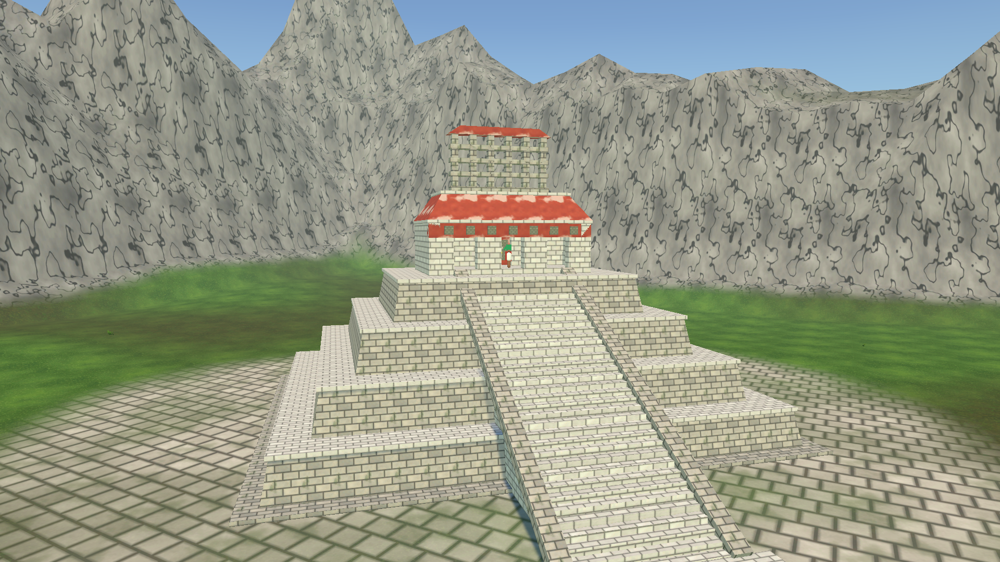
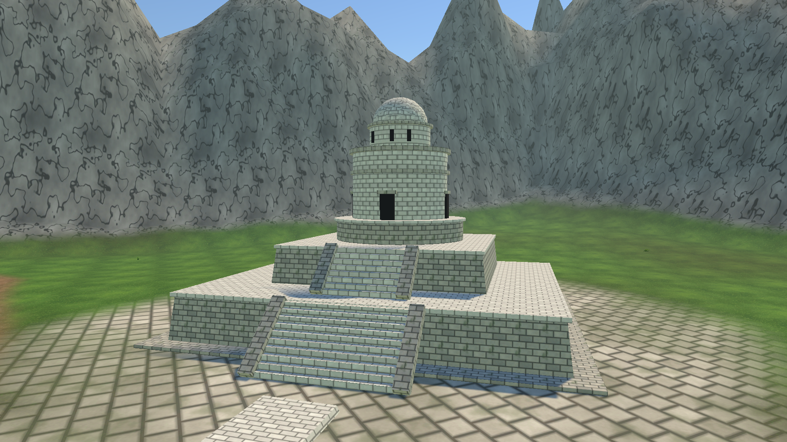
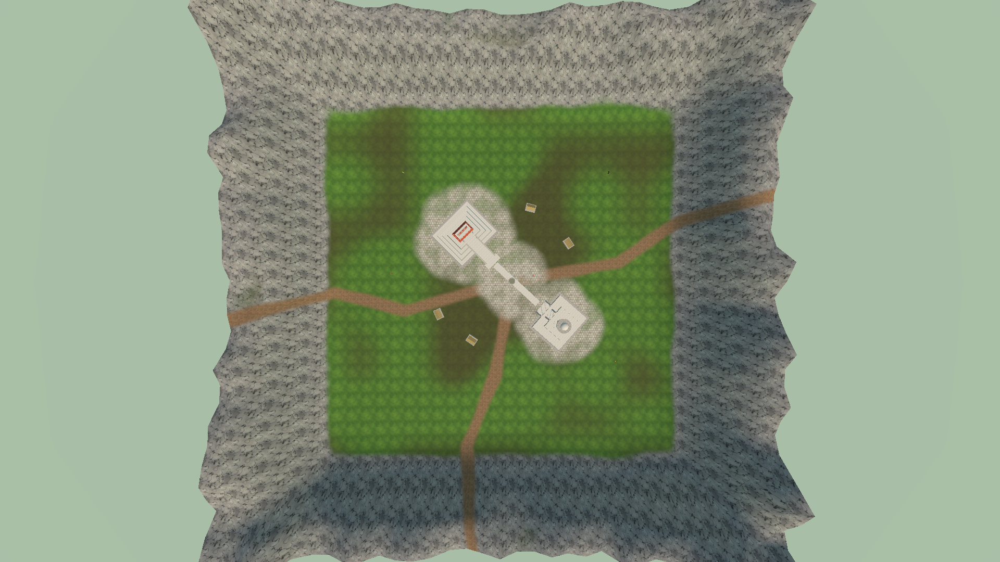
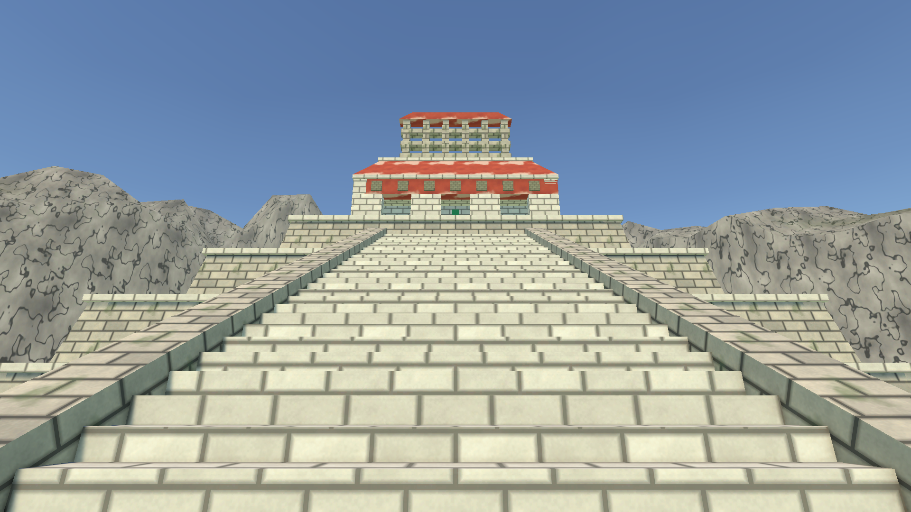
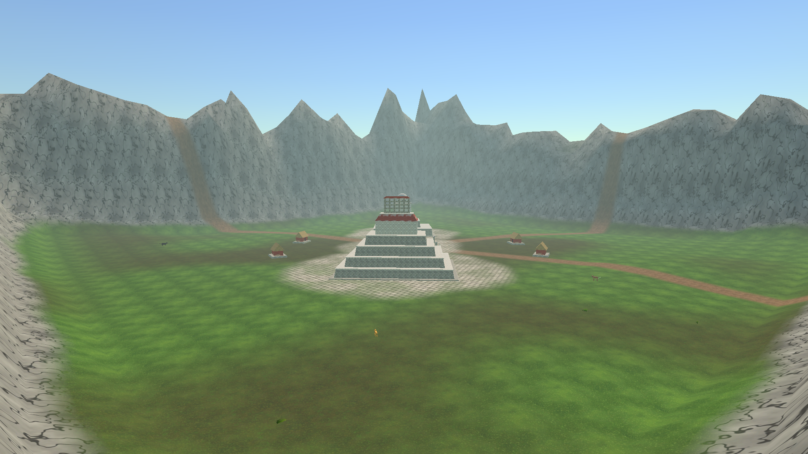

# The Lost City 

**CCOM4302 – Video Games Development · Challenge 02**
Universidad de Puerto Rico, Recinto de Río Piedras · Dr. David Israel Flores Granados
Unity 6 (6000.5.10f1) · Universal Render Pipeline · ProBuilder 6.1.2

**Team:**: Jahir Mercado, 

---

## Table of Contents

1. [The Story](#the-story)
2. [Historical Background](#historical-background)
3. [Scene Tour](#scene-tour)
4. [How We Built It (Step by Step)](#how-we-built-it-step-by-step)
5. [Reproducing the Scene](#reproducing-the-scene)
6. [Project Structure](#project-structure)
7. [References](#references)

---

## The Story

For more than thirty years, Professor Ian Curtis chased a single line of carved glyphs. He first saw it as a child in a museum. The inscription named a lost city. It said the city was "cradled by the mountains", and it claimed that the city's lords had copied the sacred temples of Palenque and the sky-watching tower of Chichén Itzá, then set both inside a single valley. Most of his colleagues thought the city was a myth. The professor spent his summers, his savings, and eventually his career on survey flights, LiDAR maps and long treks through the rainforest of the Maya lowlands. Each season ended the same way: another ridge, another empty valley.

In his final field season, the survey team followed a dry riverbed through a gap in a wall of jagged peaks, and the forest opened onto a hidden valley. At its heart stood a stepped pyramid crowned by a roof comb, facing a round observatory across a white stone causeway. Both were almost untouched. The professor photographed every stone. The photographs in this repository are his. Back home, he spent his last years turning those photographs into a hand-carved miniature of the city.

We are the college students who worked beside him. First as field assistants on the expedition, and now as the team responsible for archiving and recompiling his work. A hand-carved model is fragile, and photographs fade, so we rebuilt his miniature in Unity to preserve it. Every building is modeled in ProBuilder the way he carved it: block by block, tier by tier. The terrain follows the real height data of the Maya forest. The valley is painted layer by layer, as he painted his model. This project is our recreation of his recreation: a digital archive of a lifetime of searching, and the first step toward a game in which players retrace the expedition and discover The Lost City for themselves.

---

**In our model:**
- **Pyramid:** four tapered tiers with cornices and a projecting stairway flanked by sloped balustrades (*alfardas*).
- **Temple:** three doorways, the inner shrine with the Foliated Cross tablet (a cross sprouting maize leaves and ears), a red mansard roof, and the lattice roof comb.

**In our model:** two stacked platforms with stairways, a round base drum, the cylindrical tower with four doorways and stone moldings, and an upper drum with **three window slits** aimed across the valley. A dome replaces the collapsed top.

### The City

- **Sacbe:** Maya cities were linked by *sacbeob*, raised white causeways of limestone plaster. In Yax Witz, a sacbe joins the temple to the observatory across a central plaza with a round altar.
- **Stelae:** carved stone monuments raised to record dates and royal deeds stand on the plaza.
- **Houses:** thatched houses on low stone platforms, like the homes of the common people, sit around the civic center.
- **Wildlife:** the placeholder animals represent species native to the Maya lowlands: the jaguar (*balam*), the scarlet macaw, the white-tailed deer and the Baird's tapir.

---

## Scene Tour

| | |
|---|---|
|  **Temple of the Foliated Cross**: stepped pyramid, projecting stairway, three-door temple, mansard roof and roof comb. |  **El Caracol**: two platforms, round tower with doorways, window slits and dome. |
|  **Top-down map**: the valley, the paved plaza and causeway, the trails and the ring of mountains. |  **Eye level from the plaza**: the view a visitor would have walking toward the temple. |

*The valley as the expedition first saw it, looking down from the mountain pass.*

---

## How We Built It (Step by Step)

### Step 0: Project Setup

1. We created a Unity 6 project with the **Universal Render Pipeline (URP)** template.
2. In **Window › Package Manager › Unity Registry**, we installed **ProBuilder** (version 6.1.2).
3. We created a new scene, `Assets/Scenes/MayanCity.unity`, and added it to the Build Settings.
4. **Fix: missing renderers.** The URP renderer assets (`PC_Renderer`, `Mobile_Renderer`) were missing from our version-control checkout, which caused the error *"Default Renderer is missing."* We restored them from a clean URP project, making sure the GUIDs matched, and re-assigned them in `PC_RPAsset` and `Mobile_RPAsset`.

### Step 1: Landscape Modeling from the Height Map

1. We downloaded a RAW height map of the Maya Forest from the **"landscapes"** folder in MS Teams.
2. We created the terrain with **GameObject › 3D Object › Terrain**. Size: 400 × 400 m, maximum height 150 m.
3. In the terrain's **Terrain Settings** (gear icon), we clicked **Import Raw…**, selected the file, and matched its **Depth** (8- or 16-bit) and **Byte Order** (Windows) to the file.
4. The imported terrain looked very rugged, so, as the instructions say, we reduced the **Heightmap Resolution to 33 × 33**. This smooths the landform while keeping its overall shape.

> **TODO before submitting:** add screenshots of the Import Raw dialog and of the 33 × 33 resolution setting. If the RAW file is placed in `Assets/MayanCity/Heightmap/`, the builder imports it and reduces it to 33 × 33 automatically.

### Step 2: Modifying the Terrain

1. With **Sculpt › Set Height** and **Smooth Height**, we flattened a plateau in the center of the valley for the city.
2. With **Raise or Lower Terrain**, we raised a narrow band of mountain ranges along the borders. The ranges have peaks of different heights, and the tallest, most jagged peaks are at the four corners. This gives the "city held in the hands of the mountains" from the story.
3. We smoothed the transition between the valley floor and the foothills so there are no hard seams.

### Step 3: Building the Pyramids with ProBuilder

Both buildings are built entirely from ProBuilder shapes (**Tools › ProBuilder › ProBuilder Window › New Shape**). We followed the hints at <https://styly.cc/tips/probuilder-modeling/>.

**The Temple** (54 ProBuilder shapes):
1. **Tiers:** four **Cubes** of decreasing size, stacked into a stepped pyramid. We moved the top-face vertices inward on each cube so the walls slope (the *talud*).
2. **Cornices:** a thin, slightly wider cube as a cornice on top of each tier.
3. **Stairway:** a **Stair** shape with 36 steps, projecting out from the pyramid so its slope clears every tier. Two sloped cubes form the side balustrades.
4. **Temple walls:** a plinth, back and side walls, and a front facade of four piers that frame **three doorways** under a carved lintel with glyph blocks.
5. **Sanctuary:** an inner wall with a central doorway, behind which is the shrine with the **Foliated Cross tablet**.
6. **Roof:** a cube with its top face scaled down to form the sloping **mansard roof**, and a **roof comb** made of posts and cross-bars.

**The Lighthouse** (30 ProBuilder shapes):
1. **Platforms:** two stacked, tapered platforms (cubes), each with a cornice and a **Stair** shape with balustrades.
2. **Tower:** **Cylinders** for the round base drum, the tower, its moldings, and the upper drum.
3. **Openings:** four dark doorways with lintels on the tower, and three narrow **astronomical window slits** on the upper drum.
4. **Dome:** an **Icosahedron** sphere, half sunk into the upper drum.

**City details:** a long cube for the **sacbe** (causeway), cylinders for the altars, cubes for the **stelae**, and cube + **Prism** houses with thatched roofs.

### Step 4: Placing the Pyramids and Painting the Terrain

1. We placed both buildings on the flattened plateau, facing each other across the plaza, with their foundations sunk slightly into the ground so no gaps show.
2. With **Paint Texture**, we created five **Terrain Layers** and painted them in turn:

   | Layer | Where it is used |
   |---|---|
   | Jungle grass | Base layer across the valley floor |
   | Jungle floor | Darker patches of soil and leaf litter |
   | Dirt trail | Footpaths leading out of the city through the mountain passes |
   | Rock | Steep slopes and the upper mountains |
   | Plaza limestone | Paved ground around the buildings, the plaza and the causeway |

3. With **Paint Details**, we defined a **grass brush** (a grass-blade texture) and painted grass across the valley, keeping it off the paved areas and the trails.

### Step 5: Configuring the Scene with Asset Store Assets

> **TODO before submitting:** list the Unity Asset Store packages you imported (name, publisher, link), add screenshots, and describe where you placed each asset.

- Some Asset Store packages use Built-in Render Pipeline shaders and show up **pink** in URP. We converted them with **Edit › Rendering › Materials › Convert Selected Built-in Materials to URP**.

### Step 6: People, Plants and Animals

- The group `Placeholders_ReplaceWithAssetStore` marks where the characters stand: villagers on the plaza, a priest in the temple doorway, jaguars and a tapir at the valley edge, a deer, and scarlet macaws perched on the stelae.

> **TODO before submitting:** replace each placeholder with an Asset Store model (same position and rotation), add native plants (ceiba trees, palms, ferns), and add screenshots.

### Step 7: Lighting and Atmosphere

1. **Sunlight:** a directional light with soft shadows.
2. **Sky:** a procedural skybox.
3. **Haze:** light exponential fog to suggest the humid air of the rainforest.
4. **Camera:** the Main Camera frames the overview of the valley.
5. 
---

## References

- Unity Technologies. *ProBuilder* and *Terrain* documentation. <https://docs.unity3d.com>
- STYLY. *ProBuilder modeling tips*. <https://styly.cc/tips/probuilder-modeling/>
