# The Lost City 

**CCOM4302 – Video Games Development · Challenge 02**
Universidad de Puerto Rico, Recinto de Río Piedras · Dr. David Israel Flores Granados
Unity 6 (6000.5.10f1) · Universal Render Pipeline · ProBuilder 6.1.2

**Team:** Jahir Mercado

---

## Table of Contents

1. [The Story](#the-story)
2. [The City](#the-city)
3. [Scene Tour](#scene-tour)
4. [How We Built It (Step by Step)](#how-we-built-it-step-by-step)
5. [References](#references)

---

## The Story

*The year is 2047.*

For most of his career, Professor Ian Curtis searched for a city that no map had ever shown. It was described in many of the ancient Maya scripts he had studied: a lost city "cradled by the mountains", whose lords had built a stepped temple like those of Palenque and a round sky-watching tower like the one at Chichén Itzá, and set both inside a single valley. Most of his colleagues thought the city was a myth. The professor spent decades on survey flights, LiDAR maps and long treks through the rainforest of the Maya lowlands. Each season ended the same way: another ridge, another empty valley.

Then he reunited with an old friend from high school. His friend had become a billionaire tech mogul, and, as it turned out, had been fascinated by the ancient Maya cities for just as long. As they talked about the lost city, the mogul made an offer: a new kind of robot, built to travel through any terrain on Earth, with advanced location and tracking systems that could map ruins hidden under the jungle. The professor and his student researchers joined the mogul's engineers to design and build it, and they sent the robot into the rainforest to find the city.

For a year, the robot found nothing. It climbed ridges, crossed rivers and scanned valley after valley, and every report came back empty. Then, one morning, it followed a dry riverbed through a gap in a wall of jagged peaks, and the forest opened onto a hidden valley. At its heart stood a stepped pyramid crowned by a temple, facing a round observatory across a white stone causeway. Both were almost untouched. The robot had finally found the lost city.

**These are the images the robot took.** We are the professor's student researchers, and we rebuilt the city in Unity from the robot's images and scans so that anyone can explore it. Every building is modeled in ProBuilder, block by block and tier by tier. The terrain follows the real height data of the Maya forest, and the valley is painted layer by layer to match what the robot saw. This project is the first step toward a game in which players guide the robot on its search and discover The Lost City for themselves.

---
### The City

- **Causeway:** a raised white stone road joins Temple 1 to Temple 2 across a central plaza.
- **Tigers:** four tigers prowl around the base of Temple 2.
- **Robot:** the explorer robot that found the city stands at the foot of Temple 1's stairway.
- **Plants:** hundreds of colorful jungle plants grow in clusters across the valley and up the lower mountain slopes.

---

## Scene Tour

| | |
|---|---|
| 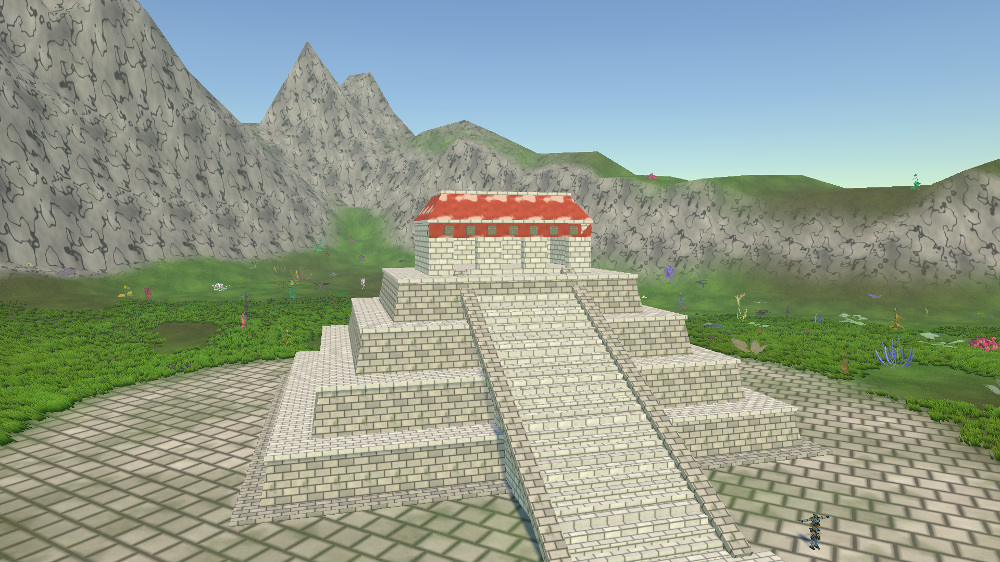 **Temple 1**: stepped pyramid, projecting stairway, three-door temple and sloped roof. | 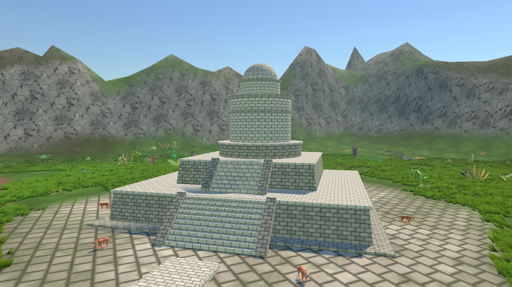 **Temple 2**: two platforms, round tower and dome. |
|  **Top-down map**: the valley, the paved plaza and causeway, the trails and the ring of mountains. |  **Eye level from the plaza**: the view a visitor would have walking toward Temple 1. |
|  **Tigers**: four tigers prowl around the base of Temple 2. |  **The explorer robot**: the robot that found the city, at the foot of Temple 1's stairway. |

*The valley as the robot first saw it, looking down from the mountain pass.*

---

## How We Built It (Step by Step)

### Step 0: Project Setup

1. We created a Unity 6 project with the **Universal Render Pipeline (URP)** template.
2. In **Window › Package Manager › Unity Registry**, we installed **ProBuilder** (version 6.1.2).
3. We created a new scene, `Assets/Scenes/MayanCity.unity`, and added it to the Build Settings.
4. **Fix: missing renderers.** The URP renderer assets (`PC_Renderer`, `Mobile_Renderer`) were missing from our version-control checkout, which caused the error *"Default Renderer is missing."* We restored them from a clean URP project, making sure the GUIDs matched, and re-assigned them in `PC_RPAsset` and `Mobile_RPAsset`.

### Step 1: Landscape Modeling from the Height Map

1. We downloaded the height maps from the **"landscapes"** folder in MS Teams (`MayanJungle_01_250x250.raw` and `MayanJungle_02_250x250.raw`) and chose **MayanJungle_01**.
2. **Fix: converting the RAW file.** Unity's **Import Raw** only accepts single-channel 8- or 16-bit files. The downloaded file is 187,500 bytes, which is 250 × 250 × 3: every height is stored three times (as an RGB image). We kept one copy of each height and saved it as a 16-bit, single-channel file, `Assets/MayanCity/Heightmap/MayanJungle_01_250x250_16bit.raw` (250 × 250 × 2 = 125,000 bytes).
3. We created the terrain with **GameObject › 3D Object › Terrain**. Size: 400 × 400 m, maximum height 150 m.
4. We imported the RAW into the terrain with these settings: **Depth:** Bit 16, **Resolution:** 250, **Byte Order:** Windows.
5. The imported terrain looked very rugged, so, as the instructions say, we reduced the **Heightmap Resolution to 33 × 33**. This smooths the landform while keeping its overall shape.

| 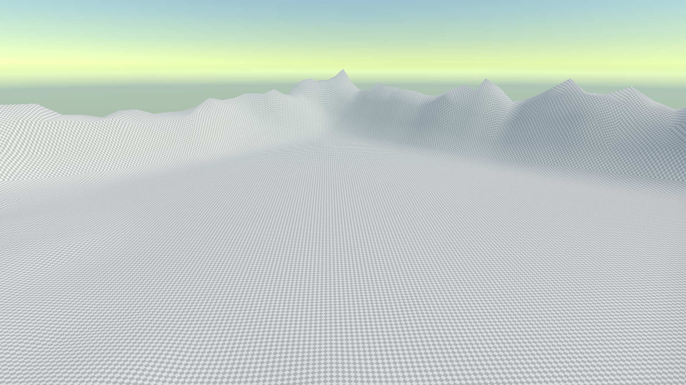 | 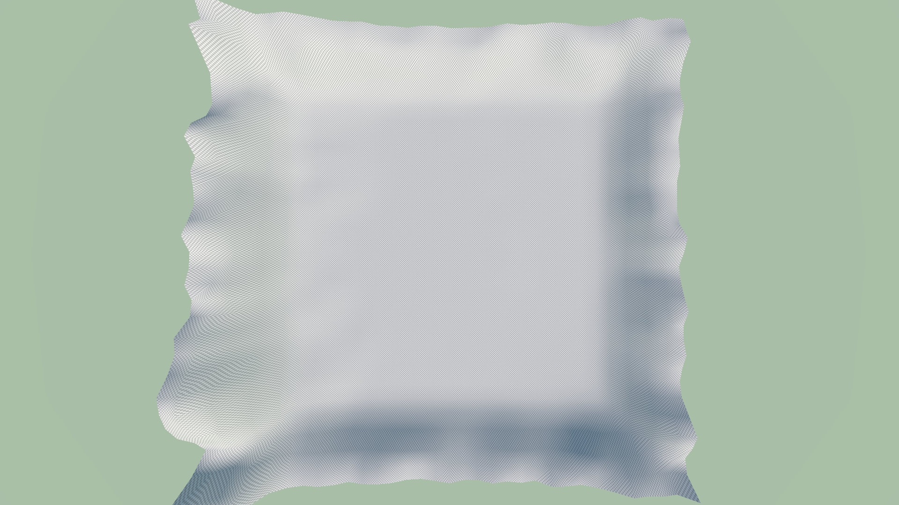 |
|---|---|
| **1a.** The terrain right after importing the RAW at 33 × 33, before any sculpting or painting. | **1b.** The same terrain from above. |

### Step 2: Modifying the Terrain

1. **The height map shapes the valley.** The RAW's hills and hollows form the valley floor, with up to 36 m of relief between its lowest and highest points.
2. **A ring of mountains.** Along the borders we raised a narrow band of mountain ranges, with the tallest, most jagged peaks at the four corners. The height of each range follows the height map: where the RAW is high, the mountains rise higher, and where it is low, they drop into grassy passes. This gives the city "cradled by the mountains" from the story.
3. **The city plateau.** With **Sculpt › Set Height** and **Smooth Height**, we flattened a plateau in the center of the valley for the city. We blended its edges into the surrounding hills over 15 m, so the rest of the valley keeps the shape of the height map.
4. We smoothed the transition between the valley floor and the foothills so there are no hard seams.

### Step 3: Building the Temples with ProBuilder

Both buildings are built entirely from ProBuilder shapes (**Tools › ProBuilder › ProBuilder Window › New Shape**). We followed the hints at <https://styly.cc/tips/probuilder-modeling/>.

**Temple 1** (32 ProBuilder shapes):
1. **Tiers:** four **Cubes** of decreasing size, stacked into a stepped pyramid. We moved the top-face vertices inward on each cube so the walls slope.
2. **Cornices:** a thin, slightly wider cube as a cornice on top of each tier.
3. **Stairway:** a **Stair** shape with 36 steps, projecting out from the pyramid so its slope clears every tier. Two sloped cubes form the side balustrades.
4. **Temple walls:** a plinth, back and side walls, and a front facade of four piers that frame **three doorways** under a carved stone beam.
5. **Roof:** a ceiling slab, then a cube with its top face scaled down to form the **sloped roof**, finished with a flat cap.

| 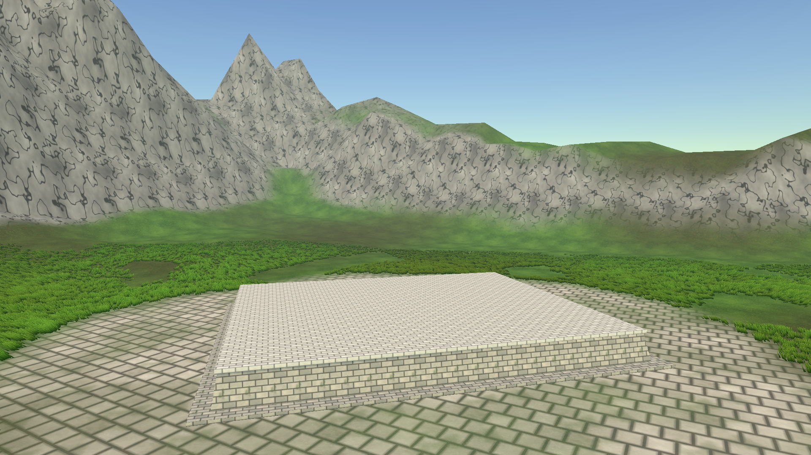 | 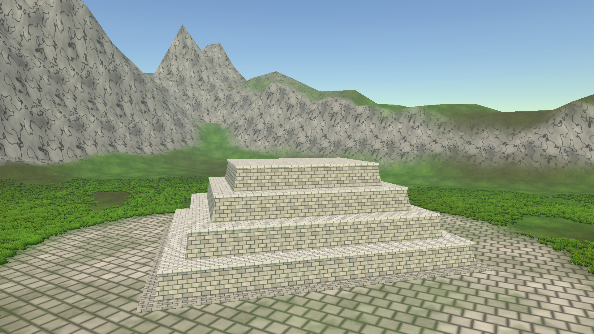 | 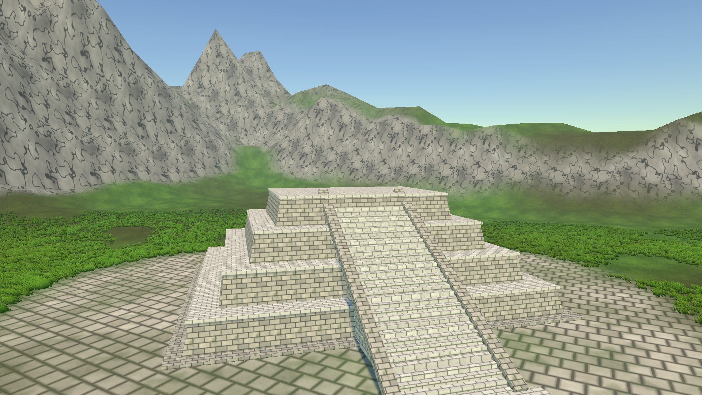 |
|---|---|---|
| **3a.** Foundation and the first tier. | **3b.** All four stepped tiers with cornices. | **3c.** The main stairway and its balustrades. |
| 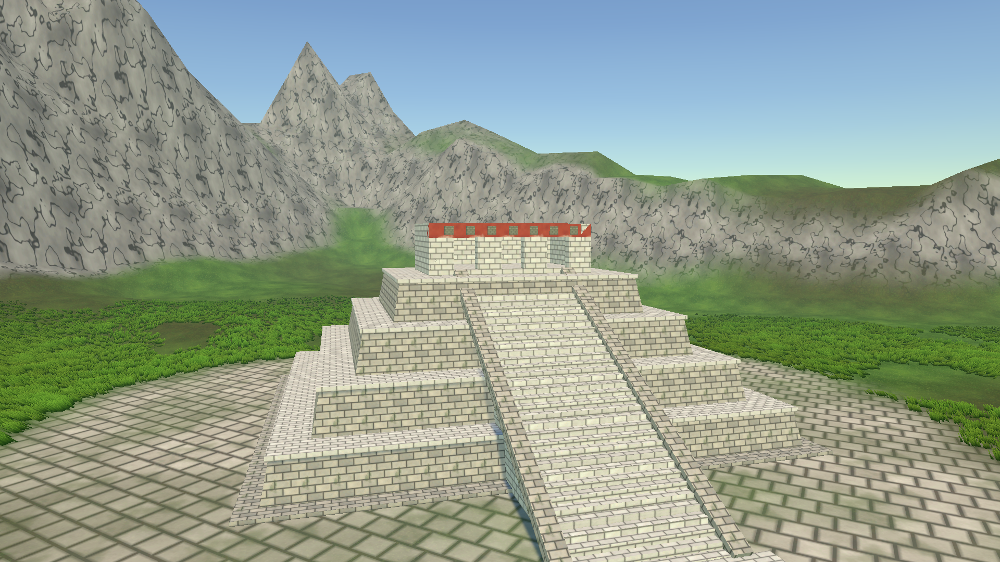 | 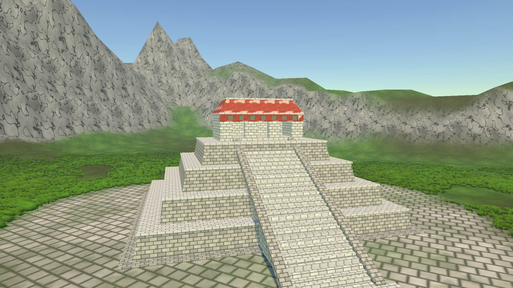 | |
| **3d.** The temple's plinth, walls and three doorways. | **3e.** Finished with the sloped roof. | |

**Temple 2** (19 ProBuilder shapes):
1. **Platforms:** two stacked, tapered platforms (cubes), each with a cornice and a **Stair** shape with balustrades.
2. **Tower:** **Cylinders** for the round base drum, the tower, its moldings, and the upper drum.
3. **Dome:** an **Icosahedron** sphere, half sunk into the upper drum.

| 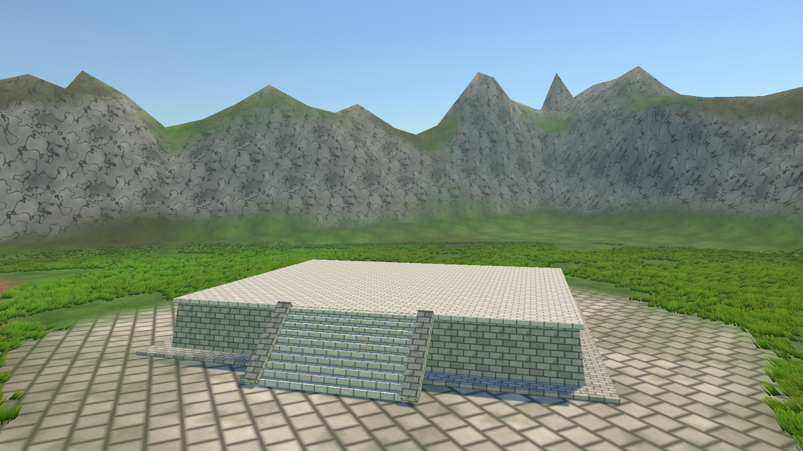 | 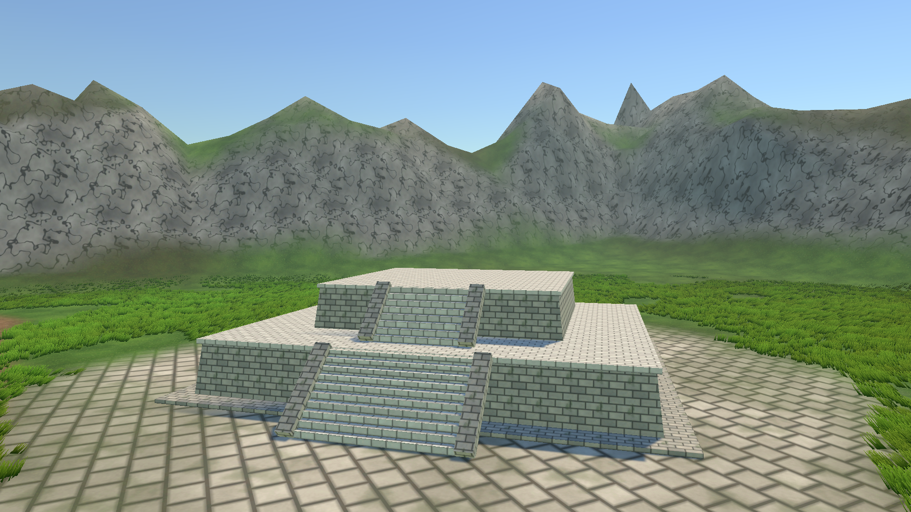 |
|---|---|
| **3f.** The lower platform and its stairway. | **3g.** The upper platform. |
| 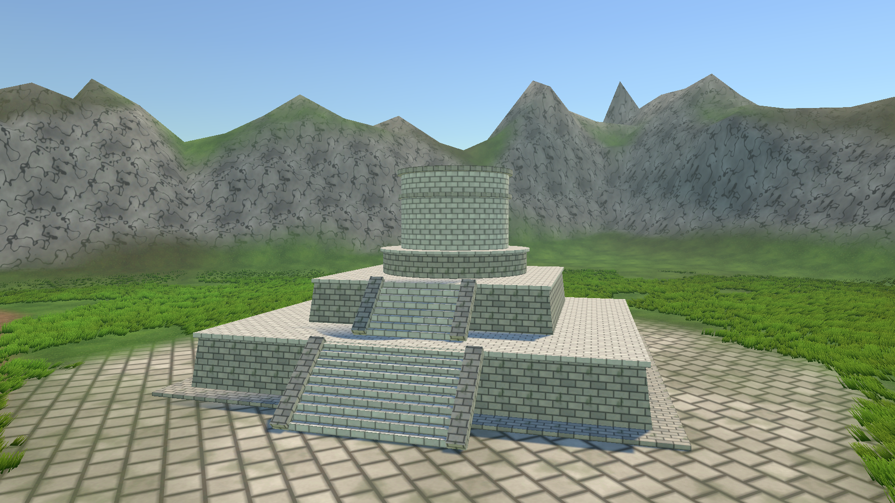 | 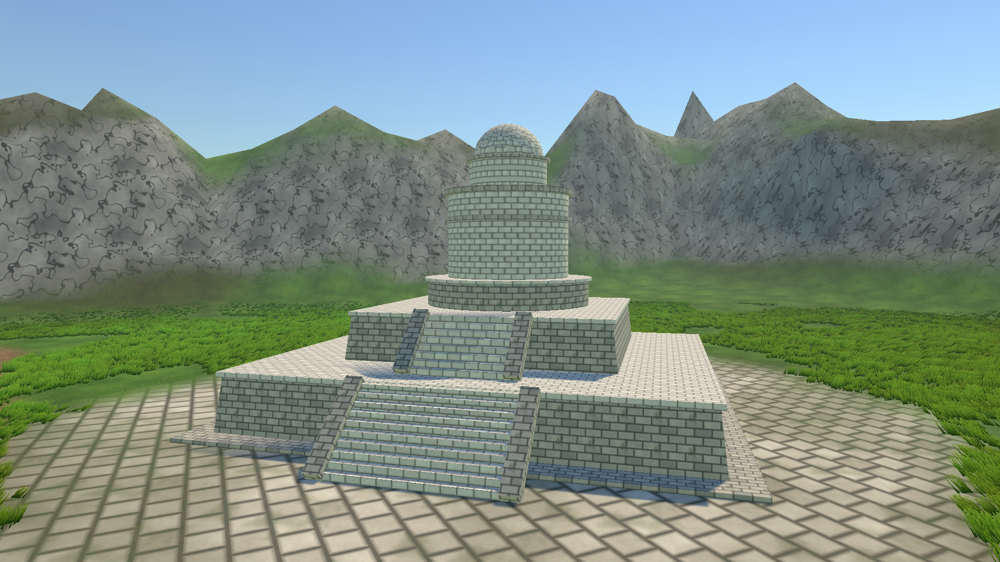 |
| **3h.** The round base drum and the tower. | **3i.** Finished with the upper drum and dome. |

**City details:** a long, tapered cube for the **causeway** between the two temples.

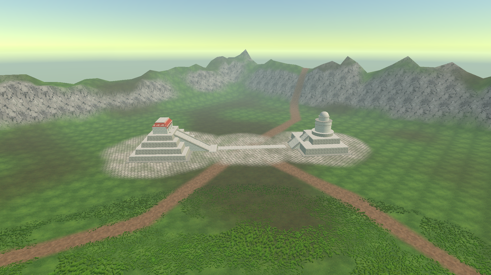
*3j. The causeway joining both temples across the plaza.*

### Step 4: Placing the Temples and Painting the Terrain

1. We placed both buildings on the flattened plateau, facing each other across the plaza, with their foundations sunk slightly into the ground so no gaps show.
2. With **Paint Texture**, we created five **Terrain Layers** and painted them in turn:

   | Layer | Where it is used |
   |---|---|
   | Jungle grass | Base layer across the valley floor |
   | Jungle floor | Darker patches of soil and leaf litter |
   | Dirt trail | Footpaths leading out of the city through the mountain passes |
   | Rock | Steep slopes and the upper mountains |
   | Plaza limestone | Paved ground around the buildings, the plaza and the causeway |

3. With **Paint Details**, we defined a **grass brush** (a grass-blade texture) and painted grass across the valley, keeping it off the paved areas and the trails.
4. **Fix: invisible grass.** At first almost no grass showed up. New terrains in Unity 6 use the **Coverage** detail scatter mode, where each cell's value (0–255) is a percentage of coverage, so our small brush values gave only a few blades. We switched the terrain's **Detail Scatter Mode** to **Instance Count**, and the grass filled in.

| 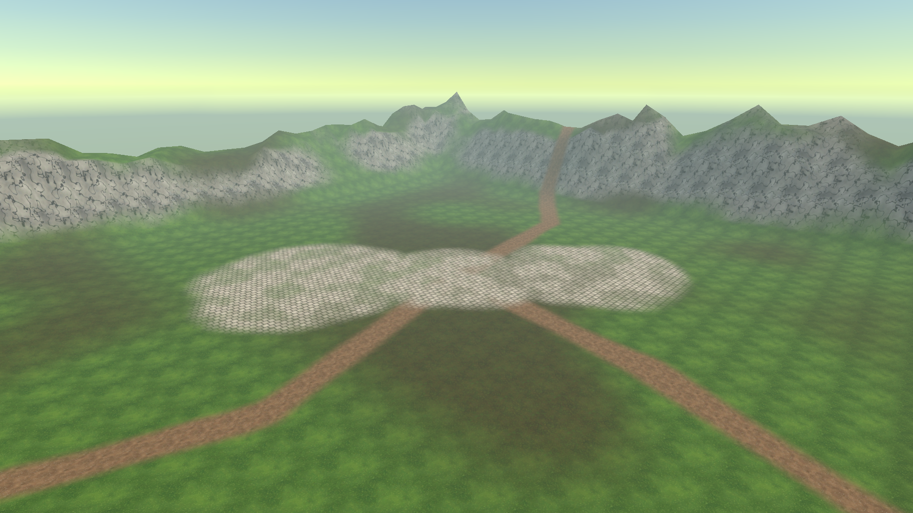 | 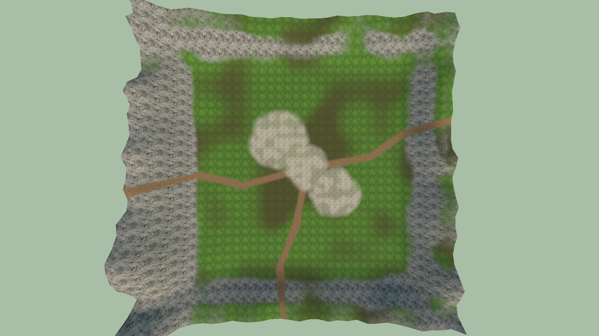 | 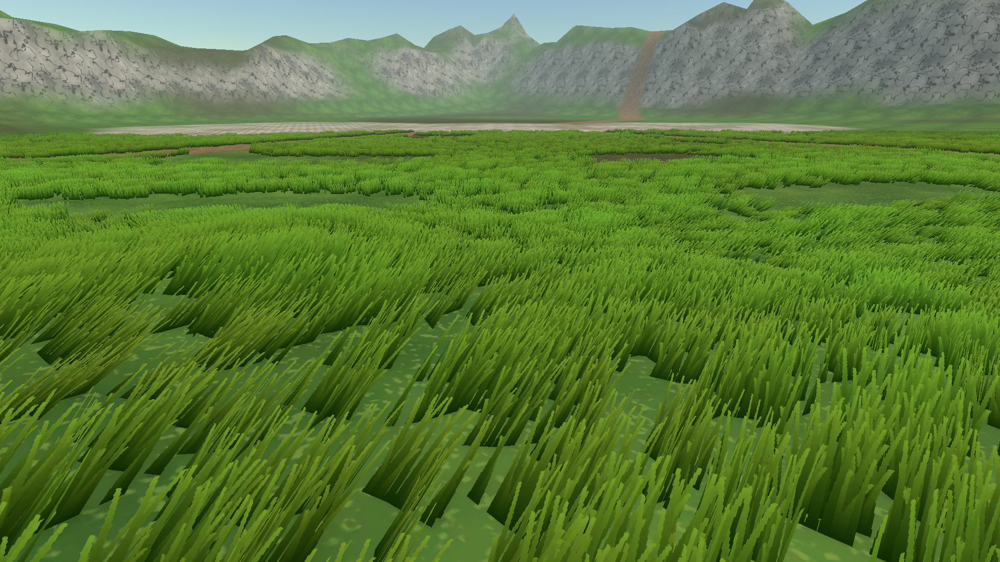 |
|---|---|---|
| **4a.** The plateau flattened and the five layers painted. | **4b.** The painted layers from above: grass, jungle floor, trails, rock and plaza. | **4c.** Grass painted with the Paint Details brush. |

### Step 5: Configuring the Scene with Asset Store Assets

1. In the Unity Asset Store we added three free packages to our account:

   | Package | Publisher | Imported to | What we used |
   |---|---|---|---|
   | **Animals FREE - Animated Low Poly 3D Models** | ithappy | `Assets/ithappy/Animals_FREE` | `Tiger_001` prefab |
   | **Robot Humanoid lowpoly** | Quad.Vertex | `Assets/Quad.Vertex` | `Robot_grey` prefab |
   | **Splash of Color - Unique Photogrammetry Plants** | — | `Assets/Splash of Color - Unique Photogrammetry Plants` | 440 whole-plant prefabs from *Medium Resolution Prefabs* |

2. In **Window › Package Manager › My Assets**, we downloaded and imported each package.
3. **Fix: pink materials.** The robot's and the plants' materials use Built-in Render Pipeline shaders (**Standard** and **Standard (Specular setup)**), so they showed up **pink** in URP. We converted them to **Universal Render Pipeline/Lit** (the same thing **Edit › Rendering › Materials › Convert Selected Built-in Materials to URP** does). We kept the albedo, normal and specular maps. For the plants we also turned on **Alpha Clipping** for the cut-out leaf shapes and set **Render Face** to *Both* so leaves show from either side. The animal pack already ships URP Lit materials.
4. **Why the plain plant prefabs.** The plant pack also has *With Level Of Detail* prefabs that switch to a flat billboard at a distance. Those billboards only turn toward the camera in Play mode, so in the editor and in our screenshots they looked like floating sheets. We used the plain *Medium Resolution Prefabs* instead.

### Step 6: Adding the Characters and Plants

1. **Tigers:** we dragged four `Tiger_001` prefabs into the scene and placed them around the base of Temple 2, each turned a different way. We scaled them to about 2.6 m long and set them on the paved ground.
2. **Fix: player controls on the tigers.** The tiger prefab comes with the pack's `CreatureMover` and `MovePlayerInput` scripts, which move the animal with the keyboard. With four tigers they would all move together, so we removed those two components from our tigers. Each tiger keeps its **Animator** and plays its idle animation in Play mode.
3. **Robot:** we placed one `Robot_grey` prefab beside the foot of Temple 1's main stairway, facing the plaza, scaled to about 2 m tall.
4. All the characters are grouped under `Characters_AssetStore` in the Hierarchy (`Tigers` and `Robots`).
5. **Plants:** we scattered 450 plants from the photogrammetry pack in clusters across the valley and up the gentler mountain slopes. We kept them off the plaza, the buildings and the trails, and left out the single-leaf, flower and hanging-vine pieces. Each plant has a random species, rotation and size (3 to 6.5 m across, like large jungle ferns and bushes). They are grouped under `Plants_AssetStore` in the Hierarchy.

| 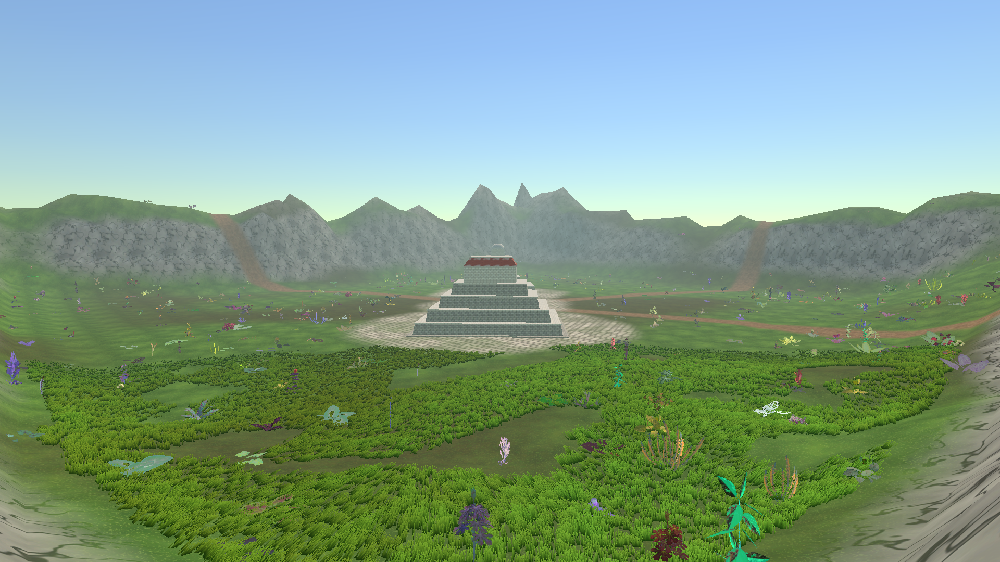 | 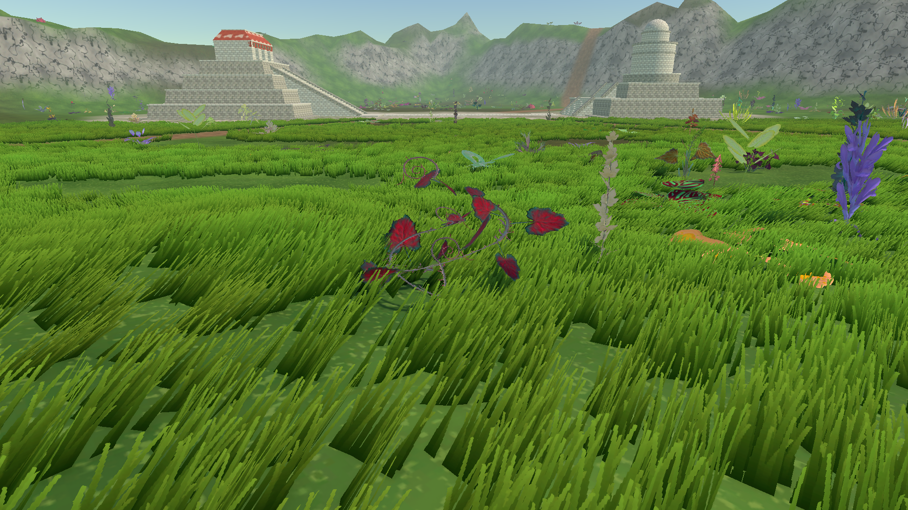 |
|---|---|
| **6a.** Plants scattered across the valley. | **6b.** A close look at the plants (same spot as picture 4c). |
| 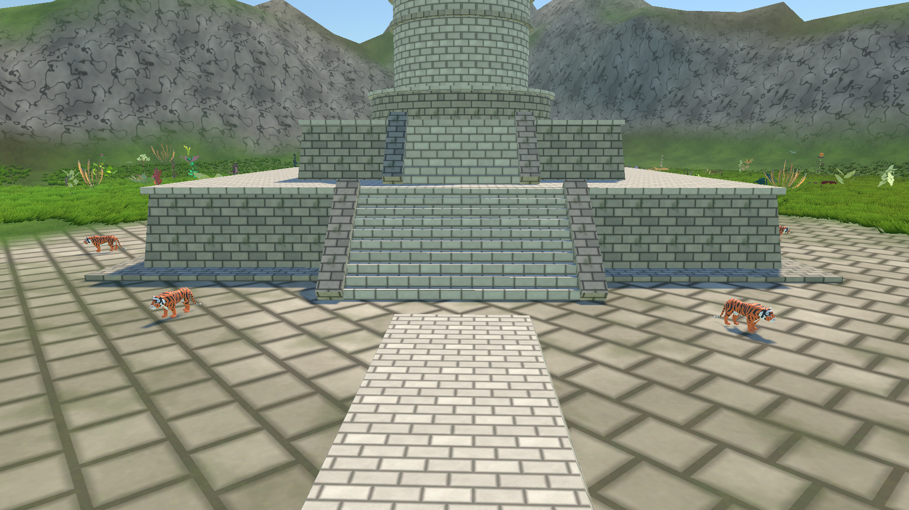 | 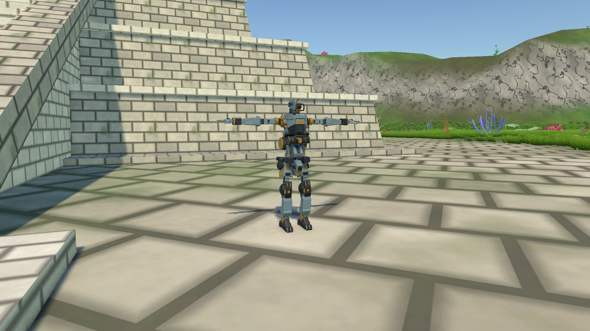 |
| **6c.** Four tigers around the base of Temple 2. | **6d.** The robot humanoid at the foot of Temple 1. |

**The finished scene** (after the sun, sky and fog were set up):

| 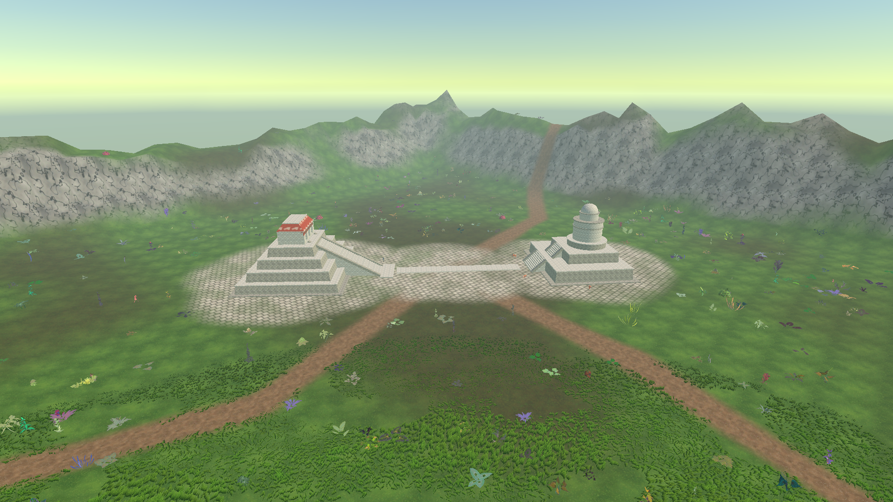 | 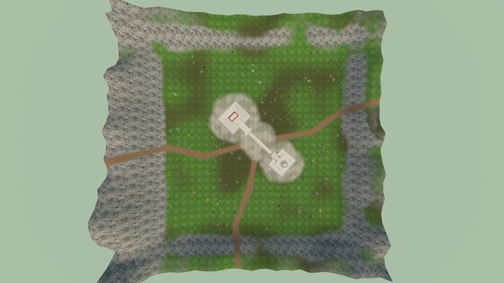 | 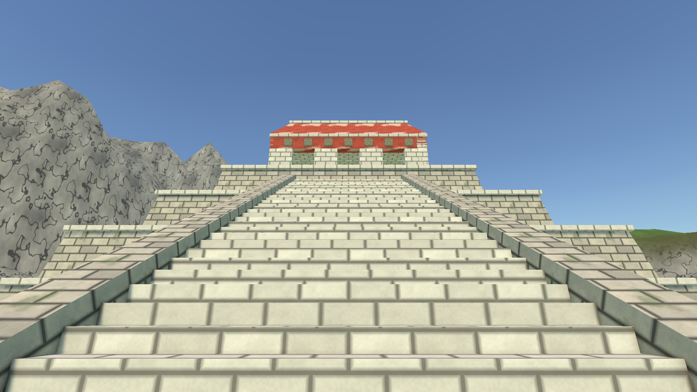 |
|---|---|---|
| Overview | Top-down map | Eye level from the plaza |

### Step 7: The Story

Our short story for the hypothetical video game is in [The Story](#the-story) at the top of this page.

## References

- Unity Technologies. *ProBuilder* and *Terrain* documentation. <https://docs.unity3d.com>
- STYLY. *ProBuilder modeling tips*. <https://styly.cc/tips/probuilder-modeling/>
- ithappy. *Animals FREE - Animated Low Poly 3D Models*. Unity Asset Store.
- Quad.Vertex. *Robot Humanoid lowpoly*. Unity Asset Store.
- *Splash of Color - Unique Photogrammetry Plants*. Unity Asset Store.

